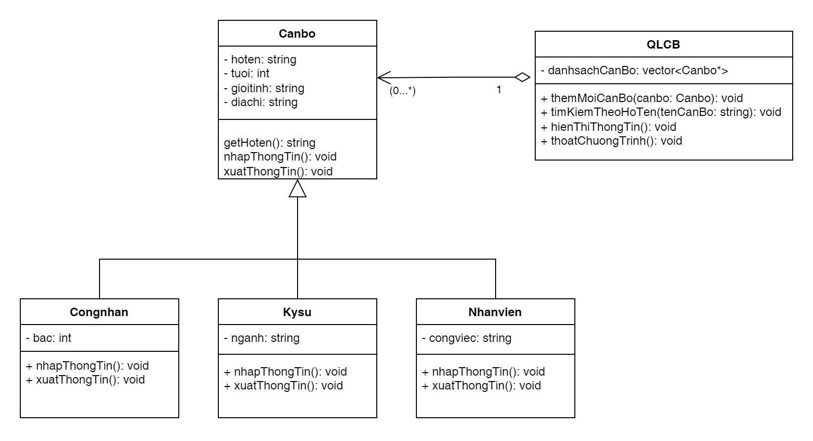

**Bài 1**  
Một đơn vị sản xuất gồm có các cán bộ là công nhân, kỹ sư, nhân viên. Mỗi cán bộ cần quản lý các dữ liệu: Họ tên, tuổi, giới tính (nam, nữ, khác), địa chỉ.

Cấp công nhân sẽ có thêm các thuộc tính riêng: Bậc (1 đến 10).  
Cấp kỹ sư có thuộc tính riêng: Ngành đào tạo.  
Các nhân viên có thuộc tính riêng: Công việc.

**Yêu cầu 1:**  
Xây dựng các lớp `CongNhan`, `KySu`, `NhanVien` kế thừa từ lớp `CanBo`.

**Yêu cầu 2:**  
Xây dựng lớp `QLCB` (quản lý cán bộ) cài đặt các phương thức thực hiện các chức năng sau:

1. Thêm mới cán bộ.
2. Tìm kiếm theo họ tên.
3. Hiển thị thông tin về danh sách các cán bộ.
4. Thoát khỏi chương trình.

  

